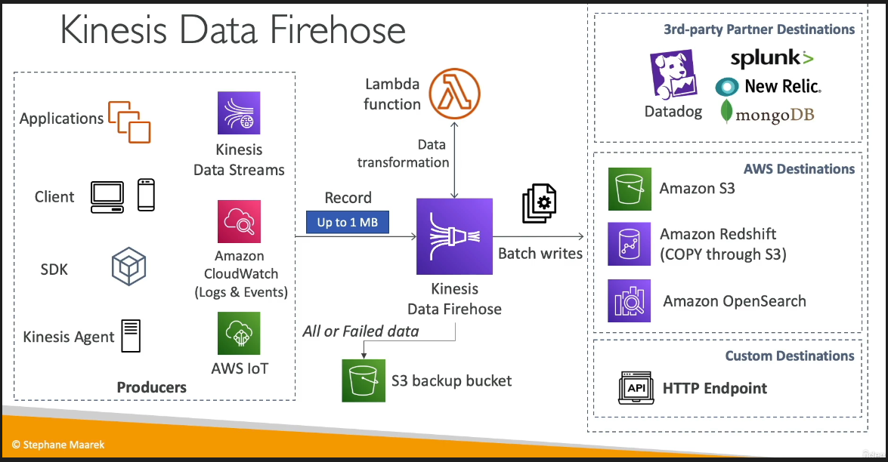

# What's Amazon Kinesis Data Firehose

Amazon Kinesis Data Firehose is a fully managed service by AWS for delivering real-time streaming data to destinations like Amazon S3, Redshift, Elasticsearch, and Splunk. It automatically scales to match data throughput, transforms data if needed (e.g., converting JSON to Parquet), and batches it before delivery, simplifying the process of capturing and loading streaming data for analytics and storage. Firehose is ideal for loading data streams into AWS for near real-time analytics, offering easy setup, scalability, and data transformation capabilities without managing any underlying infrastructure.

- Fully Managed Service, no administration
- Near Real Time (Buffer based on time and size, optionally can be disabled)
- Load data into Redshift/ Amazon S3 / OpenSearch / Splunk
- Automatic Scaling
- Supports many data formats
- Data Conversions from JSON to Parquet/ ORC (only for S3)
- Data Transformation through AWS Lambda (ex: CSV => JSON)
- Supports compression when target is Amazon S3 (GZIP, ZIP and SNAPPY)
- Only GZIP is the data is further loaded into Redshift
- Pay for the amount of data going through Firehose
- Spark / KCL do not read from KDF

## Buffer Sizing

- Firehose accumulates records in a buffer
- The buffer is flushed based on time and size rules
- Buffer Size (ex: 32MB): If that buffer size is reached, it's flushed
- Buffer Time (ex: 2 minutes): If that time is reached, it's flushed
- Firehose can automatically increase the buffer size to increase throughput
- High throughput => Buffer Size will be hit
- Low throughput => Buffer Time will be hit

## Data Streams vs Firehose

- Streams
  - Going to write custom code (producer / consumer)
  - Real time (~ 200 ms latency for classic, ~70 ms latency for enhanced fan-out)
  - Must manage scaling (shard splitting / merging)
  - Data Storage for 1 to 365 days, replay capability, multi consumers
  - Use with Lambda to insert data in real-time to OpenSearch (for example)
- Firehose
  - Fully managed, send to S3, Splunk, Redshift, OpenSearch
  - Serverless data transformations with Lambda
  - Near real time
  - Automated Scaling
  - No data storage
