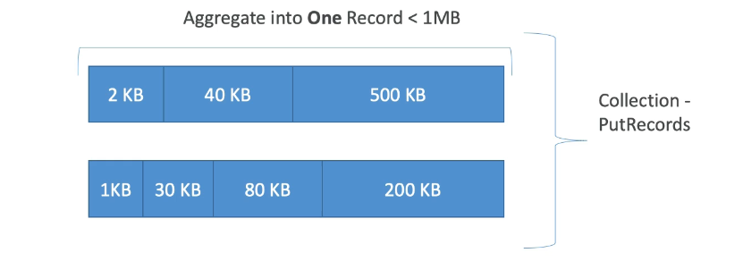
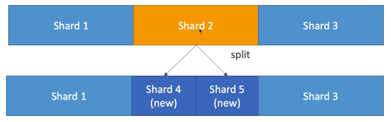
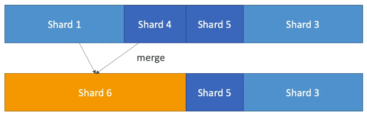
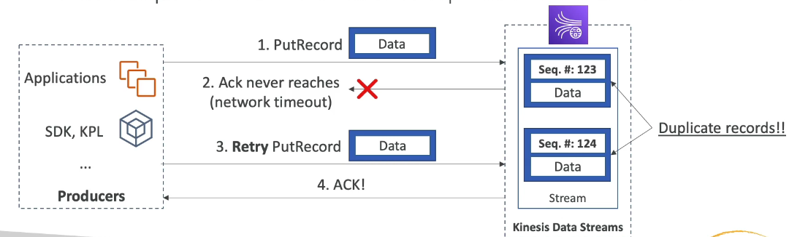
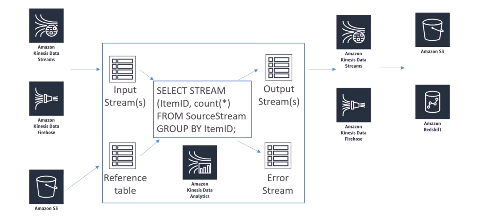

# What's Kinesis Data Streams?

Amazon Kinesis Data Streams is a real-time data streaming service provided by AWS that allows users to capture, process, and analyze large streams of data from various sources in real time. It’s designed for high-throughput, low-latency applications, enabling real-time analytics on data from sources like IoT devices, application logs, or financial transactions. Data can be consumed and processed by applications immediately or stored in Kinesis for further use, supporting applications that require fast and continuous data updates.

- Retention between 1 day to 365 days
- Ability to reprocess (replay) data
- Once data is inserted in Kinesis, it can't be deleted (immutability)
- Data that shares the same partition goes to the same shard (ordering)
- Producers: AWS SDK, Kinesis Producer Library (KPL), Kinesis Agent
- Consumers:
  - Write your own: Kinesis Client Library (KCL), AWS SDK
  - Managed: AWS Lambda, Kinesis Data Firehose, Kinesis Data Analytics

## Capacity modes

- Provisioned mode
  - you choose the number of shards provisioned, scale manually or using API
  - Each shard gets 1MB/s in (or 1000 records per second)
  - Each shard gest 2MB/s out (classic or enhanced fan-out consumer)
  - You pay per shard provisioned per hour
- On-Demand mode
  - No need to provision or manage the capacity
  - Default capacity provisioned (4 MB/s in or 4000 records per second)
  - Scales automatically based on observed throughput peak during the last 30 days
  - Pay per stream per hour & data in/out per GB

## Producers

- Kinesis SDK
- Kinesis Producer Library (KPL)
- Kinesis Agent
- 3º party libraries
  - Spark
  - Log4j
  - Appenders
  - Flume
  - Kafka Connect
  - NiFi
  - ...

### Producer SDK - PutRecord(s)

- APIs that are used are PutRecord (one) and PutRecords (many records)
- PutRecords uses batching and increases throughput => less HTTP requests
- ProvisionedThroughputExceeded if we go over the limits
- - AWS Mobile SDK: Android, IOS, etc...
- Use case: low throughput, higher latency, simple API, AWS Lambda
- Managed AWS sources for Kinesis Data Streams
  - CloudWatch Logs
  - AWS IoT
  - Kinesis Data Analytics

#### API - Exceptions

- ProvisionedThroughputExceeded Exceptions
  - Happens when sending more data (exceeding MB/s or TPS for any shard)
  - Make sure you don't have a hot shard (such as your partition key is bad and too much data goes to that partition)
- Solution
  - Retries with backoff
  - Increase shards (scaling)
  - Ensure your partition key is a good one

### Kinesis Producer Library (KPL)

- Easy to use and highly configurable C++/Java library (Java is most common)
- Used for bulding high performance, long-running producers
- Automated and configurable retry mechanism
- Synchronous or Asynchronous API (better performance for async)
- Submits metrics to CloudWatch for monitoring
- Batching (both turned on by default) - increase throughput, decrease cost
  - **Collect** Records and Write to multiple shards in the same PutRecords API call
  - Aggregate - Increased latency
    - Capability to store multiple records in one record (go over 1000 records per second limit)
    - Increase payload size and improve throughput (maximize 1MB/s limit)
- Compression must be implemented by the user
- KPL Records must be de-coded with KCL os special helper library

#### Batch

- We can influence the batching efficiency by introducing some delay with RecordMaxBufferedTime (default 100ms)

### When not to use

- The KPL can incur an additional processing delay of up to RecordMaxBufferedTime within the library (user-configurable)
- Larger values of RecordMaxBufferedTime results in higher packing efficiencies and better performance
- Applications that cannot tolerate this additional delay may need to use the AWS SDK directly

## Kinesis Agent

- Monitor Log files and sends the to Kinesis Data Stream
- Java-based agent, built on top of KPL
- Install in Linux-based server environments
- Features
  - Write from multiple directories and write to multiple streams
  - Routing feature based on directory/log file
  - Pre-process data before sending to streams (single line, csv to json, log to json...)
  - The agent handles file rotation, checkpointing, and retry upon failures
  - Emits metrics to CloudWatch for monitoring

## Consumers - Classic

- Kinesis SDK
- Kinesis Client Library (KCL)
- Kinesis Connector Library
- 3º party libraries: Spark, Log4j, Appenders, Flume, Kafka, Connect...
- Kinesis Firehose
- AWS Lambda
- Kinesis Consume Enhanced Fan-Out discussed in the next lecture

### Kinesis Consumer SDK - GetRecords

- Classic Kinesis - Records are polled by consumers from a shard
- Each shard has 2 MB total aggregate throughput
- Getrecords returns up to 10MB of data (then throttle for 5 seconds) or up to 10000 records
- Maximum of 5 GetRecords API calls per shard per second = 200ms latency
- If 5 consumers application consume from the same shard, means every consumer can poll once a second and receive less than 400 KB/s

### Kinesis Client Library (KCL)

- Java-first library but exists for other languages too (Golang, Python, Ruby, Node, .NET...)
- Read records from Kinesis produced with the KPL (de-aggregation)
- Share multiple shards with multiple consumers in one "group", shard discovery
- Checkpointing feature to resume progress
- Leverages DynamoDB for coordination and checkpointing (one row per shard)
  - Make sure you provision enough WCU/RCU
  - Or use On-Demand for Amazon DynamoDB
  - Otherwise DynamoDB may slow down KCL
- Record processors will process the data
- ExpiredIteratorException => increase WCU

### Kinesis Connector Library (KCL too)

- Older Java Library (2016), leverages the KCL library
- Write data to:
  - Amazon S3
  - DynamoDB
  - Redshift
  - OpenSearch
- Kinesis Firehose replaces the Connector Library for a few of these targets, Lambda for the others

## Kinesis Enhanced Fan Out

- New game-changing feature from August 2018
- Works with KCL 2.0 and Aws Lambda (Nov 2018)
- Each Consumer get 2 MB/s of provisioned throughput per shard
- That means 20 consumers will get 40 MB/s per shard aggregated
- No more 2 MB/s limit!
- Enhanced Fan Out: Kinesis pushes data to consumers over HTTP/2
- Reduce latency (~70 ms)

### Enhanced Fan-Out vs Standard Consumers

- Standard Consumers:
  - Low number of consuming applications (1,2,3...)
  - Can tolerate ~200 ms latency
  - Minimize cost
- Enhanced Fan Out Consumers:
  - Multiple Consumer applications for the same stream
  - Low Latency requirements ~70ms
  - Higher costs (see Kinesis Pricing page)
  - Default limit of 20 consumers using enhanced fan-out per data stream

## Kinesis Operations

### Adding Shards

- Also called "Shard Splitting"
- Can be used to increase the Stream capacity (1MB/s data in per shard)
- Can be used to divide a "hot shard"
- The old shard is closed and will be deleted once the data is expired

### Merging Shards

- Decrease the Stream capacity and save costs
- Can be used to group two shards with low traffic
- Old shards are closed and deleted based on data expiration

### Out-of-order records after resharding

- After a reshard, you can read from child shards
- However, data you haven't read yet could still be in the parent
- If you start reading the child before completing reading the parent, you could read data for a particular hash key out of order
- After a reshard, read entirely from the parent until you don't have new records
- Note: The kinesis Client Library (KCL) has this logic already built-in, even after resharding operations.

### Auto Scaling

- Auto Scaling is not a native feature of Kinesis
- The API call to change the number of shards is UpdateShardCount
- We can implement Auto Scaling with AWS Lambda

### Scaling limitations

- Resharding cannot be done in parallel. Plan capacity in advance.
- You can only perform one resharding operation at a time and it takes a few seconds
- For 1000 shards, it takes 30k seconds (8.3 hours) to double the shards to 2000
- **You can't do the following:**
  - Scale more than 10x for each rolling 24-hour period for each stream
  - Scale up to more than double your current shard count for a stream
  - Scale down below half your current shard count for a stream
  - Scale upo to more than 500 shards in a stream
  - Scale a stream with more than 500 shards down unless the result is fewer than 500 shards
  - Scale up to more than the shard limit for your account

## Handling Duplicates

### For Producers

- Producer retries can create duplicates due to network timeouts
- Although the two records have identical data, they also have unique sequence numbers
- Fix: embed unique record ID in the data to de-duplicate on the consumer side

### For consumers

- Consumer retries can make your application read the same data twice
- Consumer retries happen when record processors restart:

 1. A worker terminates unexpectedly
 2. Worker instances are added or removed
 3. Shards are merged or split
 4. The application is deployed

- Fixes:
  - Make your consumer application idempotent
  - If the final destination can handle duplicates, it's recommended to do it there

## Security

- Control access/authorization using IAM policies
- Encryption in flight using HTTPS endpoints
- Encryption at rest using KMS
- Client side encryption must be manually implemented (harder)
- VPC Endpoints available for Kinesis to access within VPC

## Troubleshooting Kinesis Data Stream Producers

### Performance

- Writing is too slow
  - Service limits may be exceeded. Check for throughput exceptions. see what operations are being throttled. Different calls have different limits.
  - There are shard-level limits for writes and reads.
  - Other operations (ie. CreateStream. ListStreams, DescribeStreams) have stream-level limits of 5-20 calls per second.
  - Select partition key to evenly distribute puts across shards
- Large producers
  - Batch things up. Use Kinesis Producer Library. PutRecords with multi-records, or aggregate records into larger files.
- Small producers (i.e apps)
  - Use PutRecords or Kinesis Recorder in the AWS Mobile SDKs

### Other issues

- Stream returns a 500 or 503 error
  - This indicates an AmazonKinesisException error rate above 1%
  - Implement a retry mechanism
- Connection errors from Flink to Kinesis
  - Network issue or lack of resources in Flink's environment
  - Could be a VPC misconfiguration
- Timeout erros from Flink to Kinesis
  - Adjust RequestTimeout and SetQueueLimit on FlinkKinesisProducer
- Throttling errors
  - Check for hot shards with enhanced monitoring (shard-level)
  - Check logs for "micro spikes" or obscure metrics breaching limits
  - Try a random partition key or improve the key's distribution
  - Rate-limit
- Records get skipped with Kinesis Client Library
  - Check for unhandled exceptions on processRecords
- Records in same shard are processed by more than one processor
  - May be due to failover on the record processor workers
  - Adjust failover time
  - Handle shutdown methods with reason "ZOMBIE"
- Reading is too slow
  - Increase number of shards
  - maxRecords per calls is too slow
  - Your code is too slow (test an empty processor vs. yours)
- GetRecords returning empty results
  - May need more write capacity on the shard table in Amazon DynamoDB
- Record processing falling behind
  - Increase retention period while troubleshooting
  - Usually insufficient resources
  - Monitor with GetRecords.IteratorAgeMilliseconds and MillisBehindLatest

## Troubleshooting Kinesis Data Stream Consumers

- High latency
  - Monitor with GetRecords. Latency and IteratorAge
  - Increase shards
  - Increase retention period
  - Check CPU and memory utilization (may need more memory)
- 500 errors
  - Same as producers - indicates a high error rate (>1%)
  - Implement a retry mechanism
- Blocked or stuck KCL application
  - Optimize your processRecords method
  - Increase maxLeasesPerWorker
  - Enable KCL debug logs
- Lambda function can't get invoked
  - Permissions issue on execution role
  - Function is timing out (check max execution time)
  - Breaching concurrency limits
  - Monitor IteratorAge metric; It will increase is this is a problem
- ReadProvisionedThroughputExceeded exception
  - Throttling
  - Reshard your stream
  - Reduce size of GetRecords requests
  - Use enhanced fan-out
  - Use retries and exponential backoff
- High Lantency
  - Monitor with GetRecords. Latency and IteratorAge
  - Increase shards
  - Increase retention period
  - Check CPU and memory utilization (may need more memory)
- 500 errors
  - Same as producers - indicates a high error rate (>1%)
  - Implement a retry mechanism
- Blocked or stuck KCL application
  - Optimize your processRecords method
  - Increase maxLeasesPerWorker
  - Enable KCL debug logs

## Kinesis Data Analytics for SQL Applications

**==DEPRECATED IN 2026==**

### References tables

- Inexpensive way to "join" data for quick lookup
  - i.e., look up the city associated with a zip code
  - Mapping is stored in S3 which is very inexpensive
  - Just use a "JOIN" command to use the data in your queries

### Kinesis Data Analytics + Lambda

- AWS Lambda can be a destination as well
- Allows lots of flexibility for post-processing
  - Aggregating rows
  - Translating to different formats
  - Transforming and enriching data
  - Encryption
- Opens up access to other services & destinations
  - Amazon Simple Storage Service (Amazon S3)
  - Amazon DynamoDB
  - Aurora
  - Amazon Redshift
  - Amazon Simple Notification Service (Amazon SNS)
  - Amazon Simple Queue Service (Amazon SQS)
  - Aws CloudWatch

## Kinesis Analytics Cost Model

- Pay only for resources consumed (but it's not cheap)
  - Charged by Kinesis Processing Units (KPUs) consumed per hour
  - 1 KPU = 1 vCPU + 4GB
- Serverless; Scales automatically
- Use IAM permissions to access streaming source and destination(s)
- Schema discovery

### RANDOM_CUT_FOREST

- SQL function used for anomaly detection on numeric columns in a stream
- They're especially proud of this because they published a paper on it
- It's a novel way to identify outliers in a data set so you can handle them however you need to
- Example: detect anomalous subway ridership during the NYC marathon
