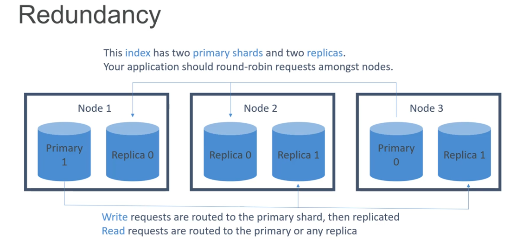

# What's Amazon OpenSearch Service?

Amazon OpenSearch Service is a fully managed service by AWS that makes it easy to deploy, operate, and scale OpenSearch clusters for log analytics, full-text search, and real-time application monitoring. It is based on open-source OpenSearch and Elasticsearch and provides built-in tools like OpenSearch Dashboards for visualization.

- Formerly ElasticSearch

## What's Opensearch?

- A fork of ElasticSearch and Kibana
- A search engine
- An analysis tool
- A visualization tool (Dashboards = Kibana)
- A data pipeline
  - Kinesis replaces Beats & LogStash

## Applications

- Full-text search
- Log analytics
- Application monitoring
- Security analytics
- Clickstream analytics

## Concepts

There are 3 different kinds of entities

- Documents
  - Documents are the things you're searching for. They can be more than text - any structured JSON data works. Every document has a unique ID, and a type
 
- Types
  - A types defines the schema and mapping shared by documents that represent the same sort of thing. (A log entry, an encyclopedia, etc.)
  - Types will be past soon
- Indices
  - An index powers search into all documents within a collection of types. They contain inverted indicies that let you search across everything within them at once

## OpenSearch Service (Managed)

- Fully-managed (but not serverless)
  - There is a separate serverless option now
- Scale up or down without downtime
  - But this isn't automatic
- Pay for what you use
  - Instace-hours, storage, data transfer
- Network isolation
- AWS integration
  - Amazon Simple Storage Service (Amazon S3) buckets (via Lambda to Kinesis)
  - Amazon Kinesis Data Streams
  - Amazon DynamoDB
  - Aws CloudWatch
  - Zone Awareness

## Opensearch Options

- Dedicated master node(s)
  - Choice of count and instance types
- "Domains"
- Snapshot to S3
- Zone Awareness

## Security

- Resource-based policies
- Identity-based policies
- IP-based policies
- Request signing
- VPC
- Cognito

## Anti-Patterns

- OLTP
  - No transactions
  - RDS or DynamoDB is better
- Ad-hoc data queryng
  - Athena is better
- Remember Opensearch is primarily for search and analytics

## Cold / Warm / Utralwarm / Hot Storage

- Standard data nodes use "hot" storage
  - Instance stores or EBS volumes / fastest performance
- Ultrawarm (warm) storage uses S3 + caching
  - Best for indices with few writes (like log data / immutable data)
  - Slower performance but much lower cost
  - Must have a dedicated master node
- Cold storage
  - Also uses S3
  - Even cheaper
  - For "periodic research or forensic analysis on older data"
  - Must have dedicated master and have UltraWarm enabled too.
  - Not compatible with T2 and T3 instace types on data nodes
  - If using fine-grained access control, must map users to cold_manager role in OpenSearch Dashboards
- Data may be migrated between different storage types

## Index State Management

- Automates index management policies
- Examples
  - Delete old indices after a period of time
  - Move indices into read only state after a period of time
  - Move indices from hot -> UtraWarm -> Cold storage over time
  - Reduce replica count over time
  - Automate index Snapshots
- ISM policies are run every 30-48 minutes
  - Random jitter to ensure they don't all run at once
- Can even send notifications when done

## More Index Management

- Index rollups
  - Periodically roll up old data into summarized indices
  - Saves storage costs
  - New index may have fewer fields, coarser time buckets
- Index transforms
  - Like rollups, but purpose is to create a different view to analyze data differently
  - Groupings and aggregations

## Cross-cluster replication

- Replicate indices / mappings / metadata across domains
- Ensures high availability in an outage
- Replicate data geographically for better latency
- "Follower"  index pulls data from "leader" index
- Requires fine-grained access control and node-to-node encryption
- "Remote Reindex" allows copying indices from one cluster to another on demand

## Stability

- 3 dedicated master nodes is best
  - Avoids "split brain"
- Don't run out of disk space
  - Minimum storage requirement is roughly: Source Data *(1 + Number of Replicas)* 1.45
- Choosing the number of shards
  - (source data + room to grow) * (1 + indexing overhead) / desired shard size
  - In rare cases you may need to limit the number of shards per node
    - You usually run out of disk space first
- Choosing instance types
  - At least 3 nodes
  - Mostly about storage requirements
  - I.e, m6g.large.search, i3.4xlarge.search, i3.16xlarge.search

## Performance

- Memory pressure in the JVM can result if
  - You have unbalanced shard allocations across nodes
  - You have too many shards in a cluster
- Fewer shards can yield better performance if JVMMemoryPressure errors are encountered
  - Delete old or unused indices

## Serverless

- On-demand autoscaling
- Works against "collections" instead of provisioned domains
  - May be "search" or "time series" type
- Always encrypted with your KMS key
  - Data access policies
  - Encryption at rest is required
  - May configure security policies across many collections
- Capacity measured in Opensearch Compute Units (OCUs)
  - Can set an upper limit, lower limit is always 2 for indexing, 2 for search