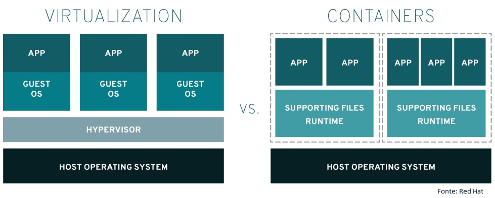

# Containers

## O que são Containers?

Um container é um ambiente isolado que contém um conjunto de processos que são executados a partir de uma imagem, imagem esta que fornece todos os arquivos necessários. Os containers compartilham o mesmo kernel e isolam os processos da aplicação do restante do sistema. Container é isolamento (recursos, processos, usuários, etc.)

## Docker e Containers são a mesma coisa?

**Containers**: São uma tecnologia que permite empacotar uma aplicação e suas dependências em um ambiente isolado. Eles são um conceito geral, independente de ferramentas específicas.

**Docker**: É uma plataforma e ferramenta que facilita a criação, execução e gerenciamento de containers. Ele popularizou o uso de containers, mas não é a única solução (outros exemplos são Podman, CRI-O e containerd).

## Por que utilizar Docker Containers?

**Exemplo**: Se você está desenvolvendo uma aplicação para um cliente, você pode fazer suas configurações nessa aplicação. Mas, em um ambiente convencional, você precisará replicar estas configurações para os outros ambientes de execução. Com um container, você estará fazendo isso em um ambiente isolado e, por causa da facilidade para replicação de containers, você acaba criando ambientes padronizados, tanto em desenvolvimento como em produção, por exemplo. Assim, você pode disponibilizar essa arquitetura toda para seu cliente, onde ele estiver: basta replicar os containers, que serão executados da mesma maneira em qualquer lugar.

Como o container possui uma imagem que contém todas as dependências de um aplicativo, ele é portátil e consistente em todas as etapas de desenvolvimento. Essa imagem é um modelo de somente leitura que é utilizada para subir um container. O Docker nos permite construir nossas próprias imagens e utilizá-las como base para os containers.

Vale lembrar que, apesar do Docker ter sido desenvolvido inicialmente com base na tecnologia LXC (Linux Containers – sendo, portanto, mais associado aos containers Linux), hoje essa tecnologia tornou-se independente de sistema operacional: podemos utilizar o Docker em ambientes Linux, Windows e até mesmo MacOS.

## Docker e Máquina Virtual são a mesma coisa?

O Docker é algo parecido com uma máquina virtual extremamente leve, mas não se trata de fato de uma máquina virtual. O Docker utiliza containers que possuem uma arquitetura diferente, permitindo maior portabilidade e eficiência. O container exclui a virtualização e muda o processo para o Docker. Então, não podemos dizer que o Docker é uma máquina virtual. Veja na imagem abaixo as diferenças entre o Docker e uma virtualização.

Podemos ver que, na virtualização, temos um maior consumo de recursos, uma vez que para cada aplicação precisamos carregar um sistema operacional. Já no Docker, podemos ver que não existe essa necessidade de múltiplos sistemas operacionais convidados.

## O que é um container engine?

Um Container Engine é o software responsável por criar, gerenciar e executar containers. Ele atua como o intermediário entre o sistema operacional e os containers, fornecendo os recursos necessários para a execução dos processos isolados. O Container engine não se comunica com o kernel, para isso ele conta com o container Runtime, sendo responsável apenas pelo gerenciamento do ambiente para a execução dos containers.

O Container Engine gerencia aspectos como:

**Criação de Containers**: Configura e inicia containers a partir de imagens.
**Isolamento**: Garante que os containers rodem de forma isolada, compartilhando apenas o kernel.
**Gerenciamento de Recursos**: Controla o uso de CPU, memória e rede pelos containers.

Exemplos de Container Engines incluem Docker Engine, containerd e CRI-O. Eles implementam os padrões necessários para trabalhar com containers, oferecendo uma interface consistente para desenvolvedores e administradores.

## O que é um container Runtime?

Para que seja possível executar os containers nos nós é necessário ter um Container Runtime instalado em cada um desses nós.

O Container Runtime é o responsável por executar os containers nos nós. Quando você está utilizando ferramentas como Docker ou Podman para executar containers em sua máquina, por exemplo, você está fazendo uso de algum Container Runtime, ou melhor, o seu Container Engine está fazendo uso de algum Container Runtime.

Temos três tipos de Container Runtime:

**Low-level**: São os Container Runtime que são executados diretamente pelo Kernel, como o runc, o crun e o runsc.

**High-level**: São os Container Runtime que são executados por um Container Engine, como o containerd, o CRI-O e o Podman.

**Sandbox e Virtualized**: São os Container Runtime que são executados por um Container Engine e que são responsáveis por executar containers de forma segura. O tipo Sandbox é executado em unikernels ou utilizando algum proxy para fazer a comunicação com o Kernel. O gVisor é um exemplo de Container Runtime do tipo Sandbox. Já o tipo Virtualized é executado em máquinas virtuais. A performance aqui é um pouco menor do que quando executado nativamente. O Kata Containers é um exemplo de Container Runtime do tipo Virtualized.
